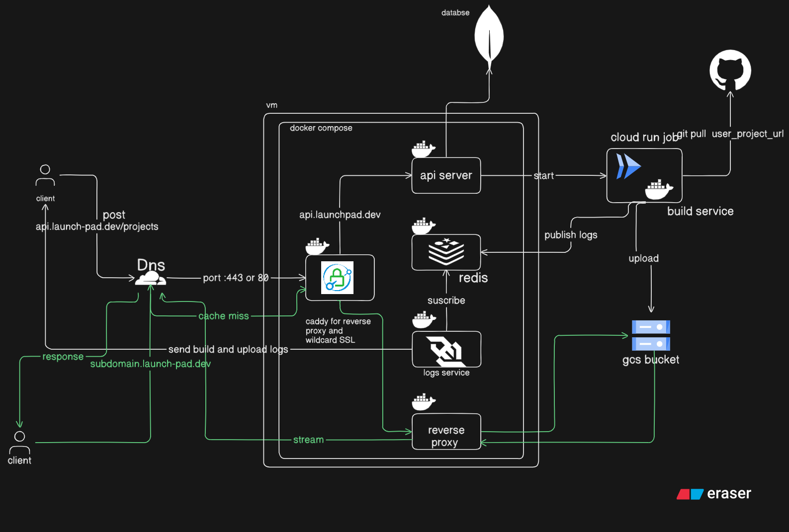

# LaunchPad

> A distributed frontend deployment platform. Deploy React, Vue, and static sites directly from GitHub with automated builds, live streaming logs, and instant custom subdomains secured by Caddy and Cloudflare. 



---

##  Features

- **One-click deploys** from GitHub repository URLs
- **Real-time build logs** streamed via WebSocket
- **Custom subdomains** for each deployed project (`project-name.launch-pad.dev`)
- **Automatic SSL/TLS** via Cloudflare
- **Edge caching** for fast global delivery
- **Scalable builds** with on-demand AWS ECS Fargate tasks
- **Terraform infrastructure** for automated AWS resource provisioning

---

## System Architecture

### How It Works

```
User → Cloudflare CDN → Caddy (Reverse Proxy) → Services → AWS
```

| Step | Description |
|------|-------------|
| **1** | User submits GitHub URL via frontend |
| **2** | Caddy manages reverse proxy and wildcard SSL |
| **3** | API Server creates project & triggers AWS ECS Fargate build task |
| **4** | Build Server clones repo, runs `npm install && npm run build` |
| **5** | Build logs stream to Redis → Logs Service → User via WebSocket |
| **6** | Built assets uploaded to Amazon S3 bucket |
| **7** | User visits `project.launch-pad.dev` → S3 Reverse Proxy serves files |
| **8** | Cloudflare caches static assets at the edge |

---

## Tech Stack


| Layer | Technology |
|-------|------------|
| **Frontend** | Next.js, React, TypeScript |
| **API Server** | Node.js, Express.js |
| **Real-time** | Socket.io, Redis Pub/Sub |
| **Database** | MongoDB |
| **Build Server** | Docker, AWS ECS Fargate Tasks |
| **Storage** | Amazon S3 |
| **Gateway** | Caddy (SSL/TLS, Reverse Proxy) |
| **CDN/DNS** | Cloudflare |
| **Infrastructure** | Terraform |

---

## Core Services

### API Server
Central control unit managing deployment requests.

Handles:
- User authentication (JWT)
- Project creation & management
- Triggering AWS ECS Fargate build tasks
- Communication with MongoDB for persistence

### Build Server (ECS Fargate)
Ephemeral Docker containers that:
- Clone GitHub repositories
- Install dependencies & execute build scripts
- Stream logs to Redis in real-time
- Upload production assets to Amazon S3
- Terminate after completion (cost-efficient)

### Logs Service
WebSocket server that:
- Subscribes to Redis Pub/Sub channels
- Streams build logs to connected frontend clients
- Enables real-time deployment progress tracking

### S3 Reverse Proxy 
Routes subdomain requests to Amazon S3 storage:
```
my-project.launch-pad.dev → S3 Bucket/__outputs/my-project/index.html
```
- Extracts subdomain from hostname
- Proxies requests to corresponding S3 folder
- Supports SPA fallback (rewriting 404s for HTML requests to index.html)
- Cloudflare caches responses at edge

---

## Request Flow

### Deployment Flow
```
User → API Server → AWS ECS Fargate (Build) → Amazon S3 (Upload) → Done
         ↓
       Redis → Logs Service → WebSocket → User (Real-time logs)
```

### Serving Flow (with Cloudflare Caching & SPA routing)
```
User → Cloudflare Edge
         ↓
    [Cache HIT?] → Yes → Return cached file ⚡
         ↓ No
    S3 Proxy → S3 Bucket → Cloudflare (cache) → User
```

---

## Getting Started

### Prerequisites
- Node.js 18+
- Docker
- MongoDB instance
- Redis instance
- AWS account with ECS, S3, VPC permissions
- Terraform (for infrastructure provisioning)

### Infrastructure Setup (Terraform)
Navigate to the `terraform` directory and execute:
```bash
cd terraform
terraform init
terraform apply -var="s3_bucket_name=your-unique-bucket-name"
```

This will automatically create your VPC, Subnets, ECS Cluster, Task Definition, Security Groups, IAM Roles, and S3 Bucket with appropriate public access policies.

### Environment Variables

Configure `.env` in the root:
```env
# API Server
MONGODB_URI=mongodb://...
REDIS_URL=redis://...
JWT_SECRET=your-secret

# AWS Config
AWS_REGION=us-east-1
AWS_ACCESS_KEY_ID=your-access-key-id
AWS_SECRET_ACCESS_KEY=your-secret-access-key
AWS_BUCKET_NAME=your-bucket-name
AWS_ECS_CLUSTER=launchpad-cluster
AWS_ECS_TASK_DEFINITION=launchpad-build-server
AWS_ECS_SUBNETS=subnet-xxxx,subnet-yyyy
AWS_ECS_SECURITY_GROUPS=sg-xxxx
AWS_ECS_CONTAINER_NAME=build-server

# S3 Reverse Proxy
BASE_PATH=https://your-bucket-name.s3.amazonaws.com
```

### Running Locally

```bash
# Start all services with Docker Compose
docker-compose up -d

# Or run individually
cd api-server && npm run dev
cd logs-service && npm run dev
cd s3-reverse-proxy && npm run dev
```

---

## Project Structure

```
LaunchPad/
├── Frontend/           # Next.js frontend
├── api-server/         # Express API server
├── build-server/       # ECS build task container
├── logs-service/       # WebSocket logs server
├── s3-reverse-proxy/   # Static file proxy
├── terraform/          # Infrastructure-as-code definitions
├── docker-compose.yml  # Local development
└── Caddyfile          # Reverse proxy config
```
